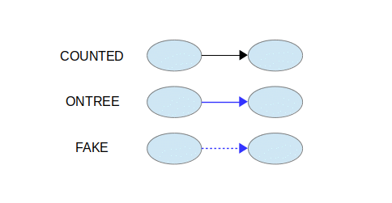
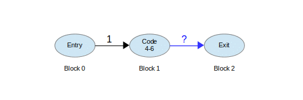
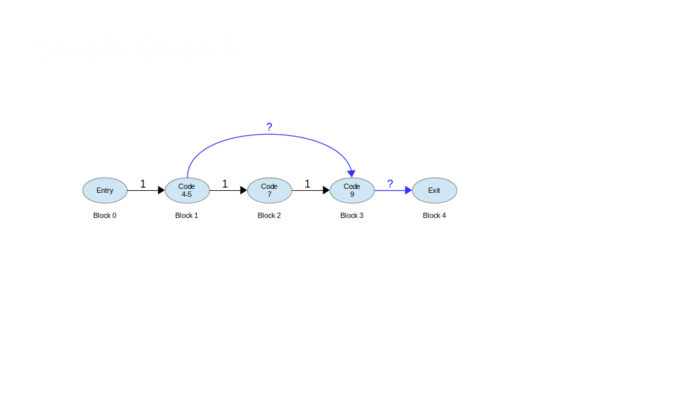
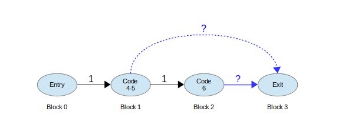
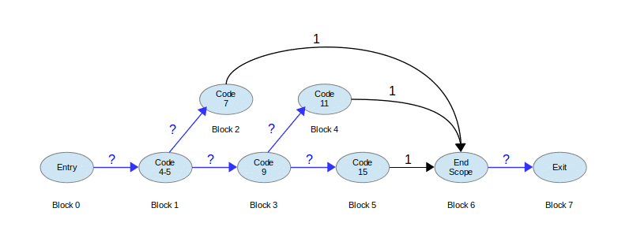
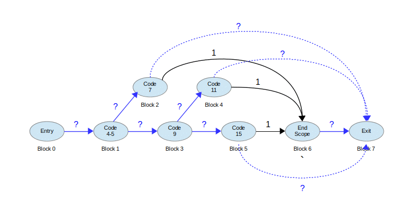

# Description
This repository contains information about the pycover.py script which is used to process gcov based code coverage results.  The code in this file only understands the gcc-11 gcov file formats.

# Progress

   * Generates .info files
   * Currently working on html summary generation

# GCC Options
The GCC commandline options described below, are utilized for instrumenting code for code coverage analysis.  These descriptions are pull directly from the gcc commandline option documentation.

https://gcc.gnu.org/onlinedocs/gcc/Instrumentation-Options.html

*-fprofile-arcs*
Add code so that program flow args are instrumented.  During execution, the program records how many times each branch and call is executed and how many times it is taken or returns.  On targets that support constructors with priority support, profiling properly handles constructors, destructors and C++ constructors (and descructors) of classes which are used as a type of a global variable.

When the compiled program exits it saves this data to a file called auxname.gcda for each source file.  The data may be used for profile-directed optimizations (-fbranch-probabilities), or for test coverage analysis (-ftest-coverage).  Each object file's auxname is generated for the name of the output file, if explicitly specified and it is not the final executable, otherwise it is the basename of the source file.  In both cases any suffix is removed (e.g. foo.gcda for input file dir/foo.c, or dir/foo.gcda for output file specified as -o dir/foo.o)

*--coverage*
This option is used to compile and link code instrumented for coverage analysis. The option is a synonym for -fprofile-arcs -ftest-coverage (when compiling) and -lgcov (when linking). See the documentation for those options for more details.

* Compile the source files with -fprofile-arcs plus optimization and code generation options. For test coverage analysis, use the additional -ftest-coverage option. You do not need to profile every source file in a program.

* Compile the source files additionally with -fprofile-abs-path to create absolute path names in the .gcno files. This allows gcov to find the correct sources in projects where compilations occur with different working directories.

* Link your object files with -lgcov or -fprofile-arcs (the latter implies the former).

* Run the program on a representative workload to generate the arc profile information. This may be repeated any number of times. You can run concurrent instances of your program, and provided that the file system supports locking, the data files will be correctly updated. Unless a strict ISO C dialect option is in effect, fork calls are detected and correctly handled without double counting.

* For profile-directed optimizations, compile the source files again with the same optimization and code generation options plus -fbranch-probabilities (see Options that Control Optimization).

* For test coverage analysis, use gcov to produce human readable information from the .gcno and .gcda files. Refer to the gcov documentation for further information.

With -fprofile-arcs, for each function of your program GCC creates a program flow graph, then finds a spanning tree for the graph. Only arcs that are not on the spanning tree have to be instrumented: the compiler adds code to count the number of times that these arcs are executed. When an arc is the only exit or only entrance to a block, the instrumentation code can be added to the block; otherwise, a new basic block must be created to hold the instrumentation code.

*-ftest-coverage*

Produce a notes file that the gcov code-coverage utility (see gcov—a Test Coverage Program) can use to show program coverage. Each source file’s note file is called auxname.gcno. Refer to the -fprofile-arcs option above for a description of auxname and instructions on how to generate test coverage data. Coverage data matches the source files more closely if you do not optimize.


# GCov Cross Profiling

Running the program will cause profile output to be generated. For each source file compiled with *-fprofile-arcs*, an accompanying .gcda file will be placed in the object file directory. That implicitly requires running the program on the same system as it was built or having the same absolute directory structure on the target system. The program will try to create the needed directory structure, if it is not already present.

To support cross-profiling, a program compiled with *-fprofile-arcs* can relocate the data files based on two environment variables:

* GCOV_PREFIX contains the prefix to add to the absolute paths in the object file. Prefix can be absolute, or relative. The default is no prefix.
* GCOV_PREFIX_STRIP indicates the how many initial directory names to strip off the hardwired absolute paths. Default value is 0.

Note: If GCOV_PREFIX_STRIP is set without GCOV_PREFIX is undefined, then a relative path is made out of the hardwired absolute paths.

For example, if the object file /user/build/foo.o was built with -fprofile-arcs, the final executable will try to create the data file /user/build/foo.gcda when running on the target system. This will fail if the corresponding directory does not exist and it is unable to create it. This can be overcome by, for example, setting the environment as ‘GCOV_PREFIX=/target/run’ and ‘GCOV_PREFIX_STRIP=1’. Such a setting will name the data file /target/run/build/foo.gcda.

You must move the data files to the expected directory tree in order to use them for profile directed optimizations (*-fprofile-use*), or to use the gcov tool.

https://gcc.gnu.org/onlinedocs/gcc/Cross-profiling.html#Cross-profiling

# File Format Descriptions
GCov utilizes two different file formats in the processing of code coverage information.  GCov uses a **Notes** file or **.gcno** file to record information about the branches, arcs and blocks that are associate with a source file and a **Data** file or **.gcda** file.  There is also a third file format **.info** file which is historically generated by **geninfo** and processed by **lcov** in order to be able to generate code coverage reports.

The **pycover.py** script can perform the function of geninfo and process data sources from varying locations in order to generate a **.info** file that combines all the information captured for a given code coverage run.  The **pycover.py** script can then also process the **.info** file in order to create HTML reports that show detailed information about the coverage associated with the captured code coverage data.

The following section describes the **.gcno** and **.gcda** that the **pycover.py** script consumes in order to generate the intermediate **.info** file and also describes the format of the **.info** file that it processes in order to create the HTML coverage report.

## Notes (.gcno) and Data (.gcda) Common File Format

### High Level Format
GCov outputs data as .gcda and .gcno files.  These files share a common overall file format.  The basic format of a gcov file consists of a single file header followed by a series of records like so:

```
[FileHeader] [Record] ... (up-to-end of file)
```

### File Header Description
The file header is made of three data items.

```
[magic] [version] [stamp]
```

The magic ident is different for the notes and the data files.  The magic ident can be used to determine the endianness of the file, when reading.  The version is the same for both files and is derived from gcc*s version number.  The stamp value is used to synchronize note and data files and to synchronize merging within with a data file.  It need not be an absolute time stamp, merely a ticker that increments fast enough and cycles slow enough to distinguish different compile/run/compile cycles.

Although the ident and version are formally 32 bit numbers, they are derived from 4 character ASCII strings.  The version number consists of the single character major version number, a two character minor version number (leading zero for versions less than 10) and a single character indicating the status of the release.  That will be **e** experimental, **p** pre-release and **r** for release.  Because, by good fortune, these are in alphabetical order, string collating can be used to compare version strings.  Be aware that the **e** designation will (naturally) be unstable and might be imcompatible with itself.  For gcc 3.4 experimental, it would be **304e** (0x33303465).  When the major version reaches 10, the letters A-Z will be used.  Assuming minor increments releases every 6 months, we have to make a major increment every 50 years.  Assuming major increments releases every 5 years, we*re ok for the next 155 years -- thats good enough for me also.


### Record Description
The records that follow the FileHeader vary in structure but can be enumerated using a structure of **Record Header** followed by **Record Buffer*

```
[Record Header] [Record Buffer]
```

Records are not nested, but there is a record hierarchy.   Tag numbers reflect this hierarchy.  Tags are unique across note and data files.  Records of a given type can vary in size depending on the amount of data they contain.

#### Logical Sections
The gcov files group some records together in logical sections.  A logical section has no formal struction in the file format itself, but is simplya grouping of records that are expected to follow each other in a sequence.  An example of a logical section is a **Function Graph** section in the GCNO files.

#### Record Header
The **Record Header** can be further broken apart as a **Tag** that indicates the type of record and a **Length** field which indicates the length of the buffer like so:

```
[Tag: UInt32] [Length: UInt32]
```
**Tag** - is a unsigned 32 bit integer that is descriptive of the type of record.  The tag value is split into 4 8-bit fields, one for each of four possible levels.  The most significant is allocated first.  Unused levels are zero.  Active levels are odd-valued, so that the LSB of the level is one.  A sub-level incorporates the values of its superlevels.  This formatting allows you to determine the tag hierarchy, without understanding the tags themselves, and is similar to the standard section numbering used in technical documents.

| Tag Values |    Category     |
|------------|-----------------|
| 1..3f      | Common Tags     |
| 41..9f     | Notes File Tags |
| a1..ff     | Data File Tags  |

**Length** - is a unsigned 32 bit integer that indicates the word length of the buffer that follows.  The word size is 4 bytes so a length of 5 would mean the buffer is 4 ** 5 bytes in size.

#### Record Buffer
The record buffer represents a collection of value fields the structure of which is determined by the type indicated in the header.

```
[Item] [Item] [Item] ... (up-to-end of buffer)
```
The record item fields can be either a UINT32 (32 bit unsigned integer), UINT64 (two 32 bit unsigned integer words), or a STRING (length, four byte aligned buffer)

#### Numerical Values
The numerical values in a GCOV file are recorded as 32 bit unsigned integers and use the endianness of the machine generating the file.

```
UInt32:   byte3 byte2 byte1 byte0  (big-endian)
UInt32:   byte0 byte1 byte2 byte3  (little-endian)
```

The 64 bit numbers are stored as two 32 bit integers, with the least significant 32 bit word stored first.

```
UInt64:  UInt32:low UInt32:high
```

#### String Values
Strings are aligned to 32 bit word boundaries and are padded with 1 to 4 NULL bytes.  This means that the buffer length for a string will always be a mulitple of 4 bytes.  The following shows the format of the string value.

```
[Length: UInt32] [Buffer]
```

The **Length** is stored as a count of the number of words (4 byte groups) used to store the string followed by 1 to 4 bytes of NULL padding.

```
Padding => '\0x00' | '\0x00\0x00' | '\0x00\0x00\0x00' | '\0x00\0x00\0x00\0x00'
```

A string which is not NULL or empty wil have a **Length**, characters and following NULL padding.

```
[Length: UInt32] [Characters] [Padding]
```

A NULL string or empty string will have a **Length** of 0 and no buffer or padding.

```
[Length: 0]
```


## Notes (.gcda) Record Formats

```
[Unit] [Function Graph: SECTION] [Function Graph: SECTION] ... (up-to-end of file)
```

### Unit Record

```
[Checksum: UINT32] [Source: STRING]
```

### Function Graph Record

```
[Function Announcement] [Basic Blocks] [Arc Set (one per basic block)] [Line Set (zero or more to end-of-record)]
```

#### Function Announcement

#### Basic Blocks
The **Basic Blocks** record indicates the number of blocks thar are applicable to the previously announced function.  The record contains a series of **Flag** entries that are **UINT32** values that provide information about the corresponding blocks.  There is a one to one correspondence between the **Flag** entries and the number of blocks in a functions.  The **Basic Blocks** record is a good way to determine the number of blocks that apply to a function.  The record length is used to determine the number of flag entries.  A record length of 5 would mean there are 5 **Flag** entries that follow and thus 5 blocks associated with the function.

```
[Record Header: (tag, length)] [Flag: UInt32] ... (up-to-end of record)
```

#### Arc Set
There is exactly one **Arc Set** record for every basic block in a function.  The **Arc Set** records are not ordered for a given function but can be matched to a functions basic block using the **BlockNo** field.  The **BlockNo** field is a zero indexed value from 0 to (block count -1) that is the index of the block that the **Arc Set** information applies to.  The **Arc Set** record is an enumeration of the arcs that are applicable for blocks and the flags that apply for each block.

```
[Record Header: (tag, length)] [BlockNo: UInt32] [Arc] ... (up-to-end of record)
```

An **Arc** item consists of:

```
[DestBlock: UINT32] [Flags: UINT32]
```
GCOV code coverage is arc based coverage.  The arcs are used to construct a directed graph that depicts the possible program flow paths between the basic blocks that make up a function.  The basic blocks correspond to the nodes in the graph and the arcs correspond to the edges or paths between the nodes in the graph.

#### Line Set
The line set records prived an association between the basic blocks of a function and the lines of the source file that correspond to the basic blocks.  There is not necessarily a **Line Set** record for every basic block.  There are some implicit basic blocks in a **gcov** function graph that do not have corresponding **Line Set** entries.  There are three kinds of basic blocks that apply to every function graph and these are the (entry), (return), and (exit) blocks.  All calls to a function must pass through the (entry) block.  All paths out of a function that do not involve an exception go through the (return) block.  All exception based exit paths go to the exit block as well as the return block.
```
[Record Header: (tag, length)] [BlockNo: UInt32] [Line] ... (up-to-end of record)
```

```
[LineNo: UINT32 = 0] [Source: STRING]
[LineNo: UINT32 = (line number)] [Source: STRING (NULL)]
[LineNo: UINT32 = 0] [Source: STRING(NULL)]
```

## Data (.gcda) Record Formats - (GCC 4.2)
The data file contains the following records.

```
[Unit]  [Function Data: SECTION] ... [Object Summary: RECORD] [Program Summary: RECORD]
```

Unit consists of:

```
[Record Header: (Tag, Length)] [CheckSum: UINT32]
```

A function data setion consists of:

```
[Function Announce: RECORD] [Arc Counts: RECORD]
```

The **Function Announce** record is the same as that in the note file, but without the source location.  It consists of:

```
[Record Header: (Tag, Length)] [Ident: UINT32] [CheckSum: UINT32]
```

The **Arc Counts** record gives the counter values for instrumented features.  The **Arc Counts** record does not contain a record for every ARC found in the graph detailed in the GCNO file.  The counters in this file correspond to the counters that do not have the GCOV_ARC_ON_TREE flag set.  The counters for the ARCs with GCOV_ARC_ON_TREE flag need to be computed by solving the graph for the missing counts.  See the section on **Function Graphs**...

```
[Record Header: (Tag, Length)] [Count: UINT64] ... (array-of Length / 2)
```

The object summary's checksum is zero.  A object summary consists of:

```
[Record Header: (Tag, Length)] [CheckSum: UINT32] [Num: UINT32] [Runs: UINT32] [Sum: UINT64] [Max: UINT64] [SumMax: UINT64]
```

The about the whole program.  The checksum is used for whole program summaries and disambiguates different programs which include the same instrumented object file.  There may be suveral program summaries, each with a unique checksum.  The structure of a program summary is the same as an object summary but with a different Tag in the header.

```
[Record Header: (Tag, Length)] [CheckSum: UINT32] [Num: UINT32] [Runs: UINT32] [Sum: UINT64] [Max: UINT64] [SumMax: UINT64]
```

**NOTE:** The data file might contain information from several runs concatenated, or the data might be merged.

## Info (.info) File Format


# Function Graphs
The directed graphs depicted below detail how GCOV records information about the flow of a program.  The GCOV data files do not contain coutners for every ARC that is detailed in the graph of a function.  The uncounted ARCs are marked as GCOV_ARC_ON_TREE and GCOV_ARC_FAKE.  The counts for these ARCs are solved for by setting the counters of the significant ARCs in the graph and then solving the graph.  The legend below shows how these uncounted ARCs are depicted in the example function graphs below.



## Simple Block
This example is the simplest possible function.  It is a function with no branches or calls.

```cpp
int global_value = 0;

void graph_simpleblock()
{
    global_value = global_value + 1;
}
```



The function results in three blocks and two ARCs.  The information in the GCNO file which describes the graph for this function has only one **Line Set** record and two **Arc Set** records.  The first block, the **Entry** block is implied and has no code associated with it, so there is no **Line Set** record for it.  The last block, the **Exit** block is also implied and so has no **Line Set** record associated with it.

The two **Arc Set** records depict the paths from the implied entry block 0 to the code block 1, then from code block 1 to the exit block 2.  The ARC from block 1 to block 2 carries the GCOV_ARC_ON_TREE flag so this arc does not have an assicated counter for it in the GCDA file counter data.  The count for this ARC is determined by solving the directed graph.


## Simple Branch

```cpp
int global_value = 0;

void graph_simplebranch(int taken)
{
    if (taken > 0)
    {
        global_value = global_value + 1;
    }
}
```


## Simple Call

```cpp
int global_value = 0;

void graph_simplecall()
{
    puts("Simple call block...");
}
```



## Mutliple Branches

```cpp
int global_value = 0;

void graph_multiplebranches(int pathSelect)
{
    if (pathSelect == 0)
    {
        global_value = global_value + 1;
    }
    else if (pathSelect == 1)
    {
        global_value = global_value + 2;
    }
    else
    {
        global_value = global_value + 3;
    }

    return;
}
```



## Mutliple Branches with Calls

```cpp
int global_value = 0;

void graph_multiplebranches_withcalls(int pathSelect)
{
    if (pathSelect == 0)
    {
        puts("Took path if...");
    }
    else if (pathSelect == 1)
    {
        puts("Took path else if...");
    }
    else
    {
        puts("Took path else...");
    }

    return;
}
```




# References

* https://gcc.gnu.org/onlinedocs/gcc/Gcov.html#Gcov

