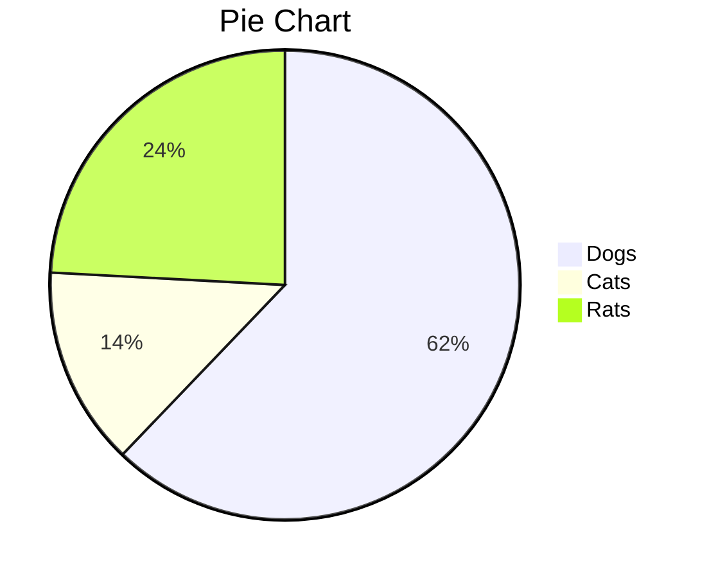

# Description
This repository contains information about the pycover.py script which is used to process gcov based code coverage results.

```mermaid
pie
    title Pie Chart
    "Dogs" : 386
    "Cats" : 85
    "Rats" : 150 
```

